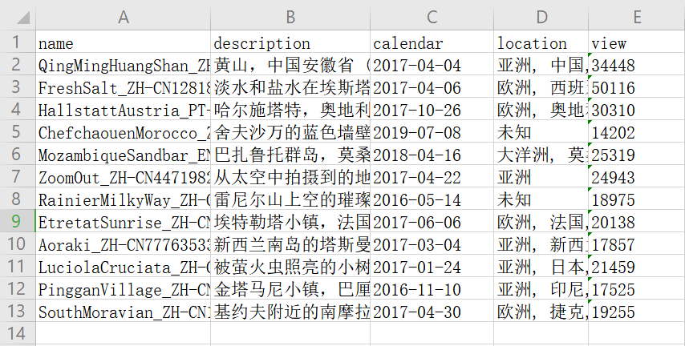
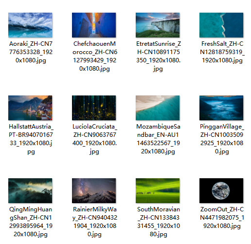

# Crawler

## crawler_picture.py

Get wallpaper pictures from [BiYing Leaderboard ](https://bing.ioliu.cn/ranking)(必应)

### Prerequisites

---

- Python
- pandas

### Getting Started

---

- **explanation of each parameter ：** 

```
usage: crawler_picture.py [-h] [-s START_PAGE] [-e END_PAGE] [-d DOWNLOAD]
                          [-w WRITE]

optional arguments:
  -h, --help            show this help message and exit
  -s START_PAGE, --start_page START_PAGE
                        起始页
  -e END_PAGE, --end_page END_PAGE
                        终止页
  -d DOWNLOAD, --download DOWNLOAD
                        是否下载图片
  -w WRITE, --write WRITE
                        是否写入excel
```

the default of **DOWNLOAD** is **False**

- **run：**

```
python crawler_picture.py -s 1 -e 2 -d True -w True
```

- **result：**

the result has been shown in the file(summary_pictures_biying.xlsx) and the floder(images)

| summary_pictures_biying.xlsx                                 | images                                                       |
| ------------------------------------------------------------ | ------------------------------------------------------------ |
|  |  |

and you can see the **download progress** on the terminal

